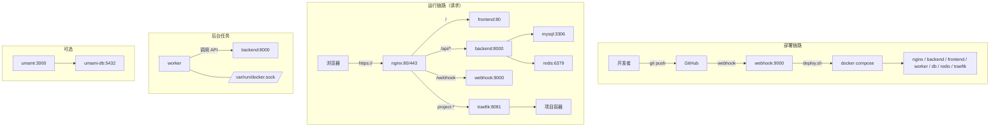

# 自动部署配置文档

## 概述

本项目使用 GitHub Webhook 自动部署。当你 `git push` 到 `main` 分支时，服务器会自动拉取最新代码、重建容器、执行数据库迁移并做健康检查。部署入口脚本为 `deploy/webhook/deploy.sh`，必要时可在服务器上手动执行作为兜底。

## 架构图



## 工作流程

1. **开发者推送代码** → `git push origin main`
2. **GitHub 发送 Webhook** → `POST https://<your-domain>/webhook`
3. **Webhook 服务验证签名** → 触发 `deploy/webhook/deploy.sh`
4. **拉取最新代码** → `git fetch && git reset --hard origin/main`
5. **重建 Docker 容器** → `docker compose -f docker-compose.prod.yml up -d --build`
6. **执行数据库迁移** → 自动跟踪版本
7. **健康检查** → 后端/前端检查
8. **清理旧镜像** → `docker image prune -f`

---

## 首次部署步骤

### 1. 服务器准备（Git 克隆）

```bash
# 克隆代码
cd /opt
git clone https://github.com/dejing/ikun.git chicken-king
cd /opt/chicken-king
```

> 说明：Webhook 部署依赖 `git fetch/reset`，服务器目录必须是 Git 仓库。

### 2. 创建生产环境配置

```bash
cd /opt/chicken-king
cp .env.production.example .env
nano .env
```

按 `Ctrl+O` 保存，`Ctrl+X` 退出。

> 注意：`deploy/webhook/deploy.sh` 会在部署时检查 `.env`，缺失会复制 `.env.production.example` 并中断，请确保已填写正确配置。

### 3. 启动主项目

```bash
cd /opt/chicken-king
docker compose -f docker-compose.prod.yml up -d --build
```

> 说明：生产环境仅使用 `docker-compose.prod.yml`，会自动创建 `chicken-king_chicken_king_network` 网络供 webhook 使用。

### 4. 初始化数据库（自动）

后端容器启动时会自动执行数据库迁移：

- **空库**：自动导入 `backend/sql/production_clean_db.sql`（如不存在则回退 `schema.sql` + `seed_production_config.sql`）
- **已有库**：自动扫描 `backend/sql/NNN_*.sql` 并执行未记录的迁移

如需关闭自动迁移，可在 `.env` 中设置：

```
AUTO_MIGRATE=false
```

如旧库没有 `schema_migrations` 表且已执行过部分迁移，可设置基线避免重复执行：

```
MIGRATION_BASELINE_VERSION=034
```

### 5. 启动 Webhook 服务

```bash
# 创建 webhook 网络
docker network create chicken-king_chicken_king_network

# 配置 webhook 密钥
nano /opt/chicken-king/deploy/webhook/.env
# 填入：WEBHOOK_SECRET=你的64字符密钥
# 可选：WECHAT_PUSH_URL=微信推送地址

# 启动 webhook
cd /opt/chicken-king/deploy/webhook
docker compose up -d --build
```

### 6. 配置 GitHub Webhook

1. 访问 `https://github.com/dejing/ikun/settings/hooks`
2. 点击 "Add webhook"
3. 配置：
   - **Payload URL**: `https://<your-domain>/webhook`
   - **Content type**: `application/json`（必须！）
   - **Secret**: 与 `/opt/chicken-king/deploy/webhook/.env` 中的 `WEBHOOK_SECRET` 一致
   - **Events**: Just the push event
4. 保存

---

## 今晚遇到的问题及解决方案

### 问题 1: React Hook "Invalid hook call" 错误

**原因**: 前端使用 Vite 开发模式运行，导致 React 被加载多次

**解决方案**:
- 修改 `frontend/Dockerfile` 为多阶段构建，生产环境使用 nginx 提供静态文件
- 修改 `docker-compose.yml` 端口映射为 `5174:80`
- 修改 `nginx/nginx.prod.conf` upstream 端口从 5174 改为 80

### 问题 2: MySQL 连接被拒绝 (Access denied)

**原因**: MySQL 数据卷保存了旧密码，与新配置不一致

**解决方案**:
```bash
docker compose down
docker volume rm chicken-king_mysql_data
docker compose up -d
# 重新导入数据库
docker exec -i chicken_king_db mysql -uroot -ppassword chicken_king < chicken_king_dump.sql
```

### 问题 3: CORS 跨域错误

**原因**: 前端 API URL 使用 `localhost:8000`，生产环境无法访问

**解决方案**:
- 修改 `frontend/src/services/api.js` 默认使用相对路径 `/api/v1`
- nginx 会将 `/api/` 请求代理到后端

### 问题 4: OAuth 登录跳转到本地

**原因**: 前端登录页面使用相对路径做 `window.location.href` 跳转不正确

**解决方案**:
- 修改 `frontend/src/pages/LoginPage.jsx` 使用 `window.location.origin + /api/v1`
- 添加 `frontend/vite.config.js` 代理配置支持本地开发

### 问题 5: OAuth 页面显示错误的应用信息

**原因**: Linux.do OAuth 应用配置缓存 或 浏览器缓存

**解决方案**:
- 清除浏览器缓存，使用无痕模式测试
- 在 Linux.do 后台重新保存应用配置

---

## 目录结构

```
/opt/chicken-king/
├── .env                        # 生产环境配置（手动维护）
├── docker-compose.prod.yml     # 生产环境编排（部署使用）
├── docker-compose.yml          # 本地开发编排（可选）
├── backend/                    # FastAPI 后端
├── frontend/                   # React 前端（生产模式用 nginx）
├── nginx/                      # Nginx 反向代理
│   ├── nginx.prod.conf         # Nginx 生产配置
│   ├── ssl/                    # SSL 证书
│   └── logs/                   # Nginx 日志
└── deploy/                     # Webhook 自动部署
    └── webhook/
        ├── app.py              # Webhook Flask 服务
        ├── deploy.sh           # 部署脚本（拉取/重建/迁移）
        ├── .env                # Webhook 密钥
        ├── Dockerfile
        ├── docker-compose.yml
        └── logs/
            ├── webhook.log
            └── deploy.log
```

---

## 常用运维命令

### 查看服务状态

```bash
docker ps
cd /opt/chicken-king && docker compose ps
```

### 查看日志

```bash
# 部署日志（启用 Webhook 时）
tail -f /opt/chicken-king/deploy/webhook/logs/deploy.log

# 后端日志
docker logs chicken_king_backend -f --tail 50

# 前端日志
docker logs chicken_king_frontend -f

# Nginx 日志
tail -f /opt/chicken-king/nginx/logs/access.log
tail -f /opt/chicken-king/nginx/logs/error.log
```

### 手动部署

```bash
# 服务器：执行部署脚本（与 Webhook 流程一致）
cd /opt/chicken-king
bash deploy/webhook/deploy.sh
```

### 重启单个服务

```bash
docker restart chicken_king_backend
docker restart chicken_king_frontend
docker restart chicken_king_nginx
```

### 数据库操作

```bash
# 进入 MySQL
docker exec -it chicken_king_db mysql -uroot -ppassword chicken_king

# 查看用户表
docker exec -it chicken_king_db mysql -uroot -ppassword chicken_king -e "SELECT id, username, role FROM users;"

# 修改用户角色
docker exec -it chicken_king_db mysql -uroot -ppassword chicken_king -e "UPDATE users SET role='admin', original_role='admin' WHERE username='xxx';"

# 备份数据库
docker exec chicken_king_db mysqldump -uroot -ppassword chicken_king > chicken_king_dump.sql

# 恢复数据库
docker exec -i chicken_king_db mysql -uroot -ppassword chicken_king < chicken_king_dump.sql
```

---

## 故障排查

### 502 Bad Gateway

```bash
docker ps  # 检查容器是否运行
docker logs chicken_king_backend --tail 30  # 查看后端日志
docker compose up -d  # 重启服务
```

### Webhook 返回 403（仅启用自动部署时）

```bash
# 检查密钥
cat /opt/chicken-king/deploy/webhook/.env

# 确保 GitHub Webhook Content-Type 是 application/json
```

### 后端无法连接数据库

```bash
# 检查环境变量
docker exec chicken_king_backend env | grep DATABASE

# 检查 MySQL 状态
docker exec -it chicken_king_db mysql -uroot -ppassword -e "SELECT 1"
```

### OAuth 登录失败

```bash
# 检查后端 OAuth 配置
docker exec chicken_king_backend env | grep -E "LINUX_DO|GITHUB|FRONTEND"

# 测试登录 URL
curl -v "http://localhost:8000/api/v1/auth/linuxdo/login" 2>&1 | grep "location:"
```

---

## 部署时间

| 阶段 | 预计时间 |
|------|----------|
| Git 拉取 | 2-5 秒 |
| Docker 构建 | 30-120 秒 |
| 容器启动 | 10-30 秒 |
| 健康检查 | 5-60 秒 |
| **总计** | **1-3 分钟** |

部署期间网站可能短暂不可用（约 10-30 秒），这是正常现象。

---

## 相关文件

| 文件 | 说明 |
|------|------|
| `deploy/webhook/deploy.sh` | 部署脚本，拉取/重建/迁移 |
| `deploy/webhook/app.py` | Webhook 接收服务 |
| `docker-compose.yml` | 主项目容器编排 |
| `nginx/nginx.prod.conf` | Nginx 反向代理配置 |
| `frontend/vite.config.js` | 前端 Vite 配置（含代理） |
| `frontend/src/services/api.js` | 前端 API 配置 |
| `backend/app/core/config.py` | 后端配置（CORS、OAuth） |
